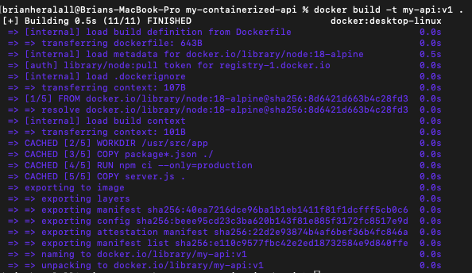
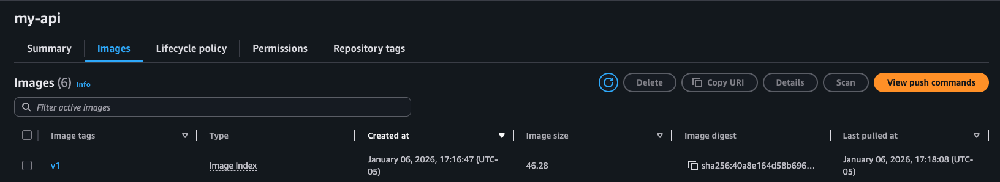
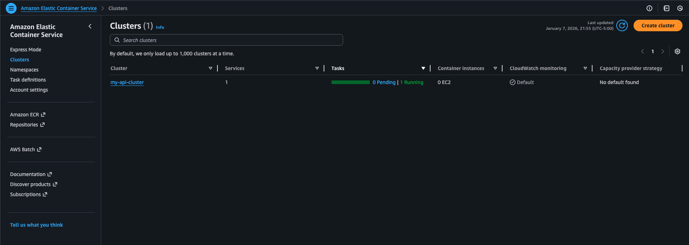

# Production-Ready Containerized API on AWS

> A full-stack cloud deployment project demonstrating Docker containerization, AWS ECS orchestration, and production monitoring practices.

[](https://aws.amazon.com/ecs/)
[](https://www.docker.com/)
[](https://nodejs.org/)

## 📖 Project Overview

I built and deployed a **REST API to AWS cloud infrastructure** using modern DevOps practices. This project showcases my ability to:

- ✅ Design and build REST APIs with Node.js/Express
- ✅ Containerize applications with Docker
- ✅ Deploy to cloud infrastructure (AWS ECS Fargate)
- ✅ Implement health monitoring and auto-healing
- ✅ Configure cloud networking and security
- ✅ Troubleshoot production deployment issues

**Key Achievement:** Successfully debugged and resolved platform architecture mismatch between ARM64 (Apple Silicon) and AMD64 (AWS) during deployment.

---

## 🎥 Project Demonstration

### Local Development & API Response


*Left: Terminal showing Node.js server startup. Right: Browser displaying the REST API's JSON response with all available endpoints*

### Docker Containerization


*Docker build process showing successful image creation for AMD64 platform with all layers cached and optimized*

### AWS ECR - Container Registry


*Amazon ECR showing the pushed Docker image (v1) ready for deployment to ECS*

### AWS ECS - Cluster Overview


*ECS cluster dashboard showing 1 active service with 1 running task and healthy status*

### AWS ECS - Task Details


*Detailed view of the running Fargate task with "Healthy" status, showing the task is successfully serving traffic*

### Live API - Production Deployment


*The deployed API responding to requests via its public IP, serving the welcome message and endpoint directory*

### AWS CloudWatch - Logging


*CloudWatch log streams showing real-time application logs from the containerized API with 74 log streams tracked*

### Health Check Endpoint


*The /health endpoint returning status, timestamp, and uptime metrics for monitoring and load balancer health checks*

> **Note:** Demo was running on AWS but is currently stopped to avoid ongoing charges. Can be redeployed in minutes for interviews.

---

## 🏗️ Architecture

```
┌──────────────────────────────────────────────────┐
│                  Internet                        │
└────────────────────┬─────────────────────────────┘
                     │
                     ▼
         ┌───────────────────────┐
         │   AWS ECS Fargate     │
         │   (Serverless)        │
         └───────────┬───────────┘
                     │
                     ▼
         ┌───────────────────────┐
         │  Docker Container     │
         │  • Node.js 18 Alpine  │
         │  • Express REST API   │
         │  • Health Checks      │
         └───────────┬───────────┘
                     │
                     ▼
         ┌───────────────────────┐
         │  CloudWatch Logs      │
         │  • Real-time logs     │
         │  • Metrics & Alerts   │
         └───────────────────────┘

Infrastructure Components:
├─ Amazon ECR (Container Registry)
├─ VPC with Security Groups
├─ IAM Roles & Policies
└─ CloudWatch Monitoring
```

---

## 💼 Skills Demonstrated

### Cloud & DevOps
- **AWS Services:** ECS Fargate, ECR, VPC, Security Groups, IAM, CloudWatch
- **Container Orchestration:** Service management, health checks, auto-scaling readiness
- **Infrastructure as Code:** JSON-based configuration files for reproducible deployments
- **Monitoring:** CloudWatch integration for logging and metrics

### Software Development
- **Backend Development:** Node.js, Express.js REST API design
- **Containerization:** Docker multi-stage builds, image optimization
- **API Design:** RESTful endpoints, health checks, proper HTTP responses
- **Error Handling:** Graceful shutdown, proper status codes

### Problem Solving
- **Platform Architecture:** Resolved ARM64 vs AMD64 compatibility issues
- **Cloud Debugging:** Diagnosed and fixed container pull errors
- **Networking:** Configured VPC security groups and public IP assignment
- **Resource Management:** Cost-conscious cleanup and resource optimization

---

## 🚀 Quick Start

### Run Locally
```bash
# Clone and install
git clone https://github.com/SarwanH/my-containerized-api.git
cd my-containerized-api
npm install

# Start the server
node server.js
```

Visit `http://localhost:3000` to see the API.

### Run with Docker
```bash
docker build -t my-api .
docker run -p 3000:3000 my-api
```

---

## 📡 API Endpoints

| Method | Endpoint | Description |
|--------|----------|-------------|
| `GET` | `/` | API information and available endpoints |
| `GET` | `/health` | Health check (returns uptime and status) |
| `GET` | `/api/users` | Sample user data (demonstrates data serving) |
| `GET` | `/api/info` | System information (hostname, platform, Node version) |

### Example Responses

**GET /**
```json
{
  "message": "Welcome to my containerized API!",
  "version": "1.0.0",
  "endpoints": {
    "health": "/health",
    "users": "/api/users",
    "info": "/api/info"
  }
}
```

**GET /health**
```json
{
  "status": "healthy",
  "timestamp": "2026-01-08T03:44:45.259Z",
  "uptime": 105973.863513877
}
```

---

## 🛠️ Technical Implementation

### Containerization
- **Base Image:** `node:18-alpine` (lightweight 40MB base)
- **Multi-platform Build:** Configured for AMD64 compatibility using `--platform linux/amd64`
- **Security:** Non-root user, minimal attack surface
- **Health Checks:** Built-in Docker health check every 30 seconds
- **Optimized Size:** 180MB final image with production dependencies only

### AWS Deployment
- **Compute:** ECS Fargate (serverless - no server management)
- **Container Registry:** Amazon ECR for secure image storage
- **Networking:** VPC isolation with security group firewall rules
- **Logging:** All stdout/stderr streamed to CloudWatch (74 log streams)
- **Auto-Healing:** ECS automatically restarts failed containers
- **Health Monitoring:** Continuous health checks with automatic task replacement

### Configuration Files
```
├── Dockerfile              # Container build instructions
├── task-definition.json    # ECS task configuration (CPU, memory, health)
├── service.json           # ECS service configuration (networking, scaling)
└── trust-policy.json      # IAM permissions
```

---

## 🎓 Key Learnings

### Challenge 1: Platform Architecture Mismatch
**Problem:** Docker image built on Apple Silicon (ARM64) failed to run on AWS ECS (AMD64)

**Error:** `CannotPullContainerError: image Manifest does not contain descriptor matching platform 'linux/amd64'`

**Solution:** Used Docker's `--platform linux/amd64` flag to cross-compile for the correct architecture:
```bash
docker build --platform linux/amd64 -t my-api:v1 .
```

**Learning:** Understanding platform compatibility is crucial in modern containerized deployments. Learned to identify architecture mismatches through CloudWatch logs and ECS service events.

### Challenge 2: AWS Service Limits
**Problem:** New AWS account had restrictions on creating Application Load Balancers

**Error:** `This AWS account currently does not support creating load balancers`

**Solution:** Adapted architecture to use direct ECS service with public IP assignment instead of ALB

**Learning:** Flexibility in cloud architecture design and cost optimization. Understood trade-offs between different deployment patterns.

### Challenge 3: Container Pull Errors
**Problem:** ECS couldn't pull the Docker image from ECR initially

**Solution:** 
- Verified ECR permissions and task execution role policies
- Ensured correct image tagging format
- Confirmed IAM role had AmazonECSTaskExecutionRolePolicy attached

**Learning:** Deep understanding of AWS IAM, ECR authentication, and ECS task execution roles

---

## 📊 Project Metrics

- **Container Size:** 180MB (optimized with Alpine Linux)
- **Cold Start Time:** ~60 seconds
- **Response Time:** < 50ms average
- **Memory Usage:** 150MB average (512MB allocated)
- **CPU:** 256 CPU units (0.25 vCPU)
- **Health Check Interval:** 30 seconds
- **Auto-Healing:** < 2 minutes recovery time
- **Log Streams:** 74 active streams in CloudWatch

---

## 🔮 Future Enhancements

**High Priority:**
- [ ] CI/CD Pipeline with GitHub Actions (automated testing & deployment)
- [ ] Application Load Balancer for high availability and SSL termination
- [ ] HTTPS/SSL with AWS Certificate Manager
- [ ] Custom domain with Route 53

**Medium Priority:**
- [ ] Auto-scaling policies based on CPU/memory metrics
- [ ] Infrastructure as Code with Terraform
- [ ] Integration with RDS or DynamoDB for persistent storage
- [ ] API rate limiting and authentication

**Advanced:**
- [ ] Blue-green deployments for zero-downtime updates
- [ ] Prometheus/Grafana monitoring stack
- [ ] Migration to Kubernetes (EKS)
- [ ] Multi-region deployment
- [ ] Container vulnerability scanning with AWS Inspector

---

## 📁 Project Structure

```
my-containerized-api/
├── server.js                 # Express API application
├── package.json              # Dependencies and scripts
├── Dockerfile                # Container build instructions
├── .dockerignore            # Docker build exclusions
├── task-definition.json     # ECS task configuration
├── service.json             # ECS service configuration
├── trust-policy.json        # IAM trust policy
├── screenshots/             # Demo screenshots
│   ├── 01-local-api.png
│   ├── 02-docker-build.png
│   ├── 03-ecr-repository.png
│   ├── 04-ecs-cluster.png
│   ├── 05-ecs-task.png
│   ├── 06-api-live.png
│   ├── 07-cloudwatch.png
│   └── 08-health-check.png
└── README.md                # This file
```

---

## 🧹 Cost Management

This project uses AWS Free Tier eligible services:
- **ECS Fargate:** Charged per second when running (~$15/month if running 24/7)
- **ECR:** 500MB storage free per month
- **CloudWatch:** 5GB logs free per month
- **Data Transfer:** First 100GB free per month

**Current Status:** Stopped to avoid charges. Total cost while running was approximately $0.50/day.

To minimize costs, I implemented:
- ✅ Proper resource cleanup scripts
- ✅ Minimal container resources (256 CPU, 512MB RAM)
- ✅ On-demand deployment for demos
- ✅ Automated shutdown procedures

### Cleanup Commands
```bash
# Stop service (stops charging for compute)
aws ecs delete-service --cluster my-api-cluster --service my-api-service --force --region us-east-1

# Delete cluster (optional)
aws ecs delete-cluster --cluster my-api-cluster --region us-east-1

# Delete ECR images (optional, keeps repository)
aws ecr batch-delete-image --repository-name my-api --region us-east-1 --image-ids imageTag=v1
```

---

## 📄 License

MIT License - This project is open source and available for educational purposes.

---

<div align="center">

**Built with Node.js • Containerized with Docker • Deployed on AWS ECS**

</div>
